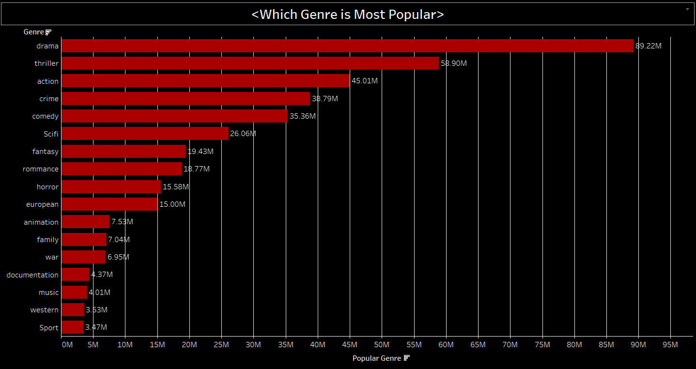

<link rel="stylesheet" href="styles.css" type="text/css">
<link rel="stylesheet" href="site_libs/academicons-1.9.1/css/academicons.min.css"/>

   

## **Movie Explorer**

 

   

### 1. Screenshot of Dashboard

   

### 2. Summary

+ Measured the popularity of three platform variables, for example, international directors, genres and countries by modeling 71,000 datasets using SQL to make recommendations on how to increase revenue  

   

### 3. Presentation 

Please click [HERE](https://uwnetid.sharepoint.com/:p:/r/sites/og_foster_msba_c4_team8/_layouts/15/doc2.aspx?action=edit&sourcedoc=%7Bcd02a3cd-00e0-497f-8c2e-a314d6d8fa4a%7D&wdOrigin=TEAMS-ELECTRON.teamsSdk.openFilePreview&wdExp=TEAMS-CONTROL&web=1) for SQL query and analysis.

