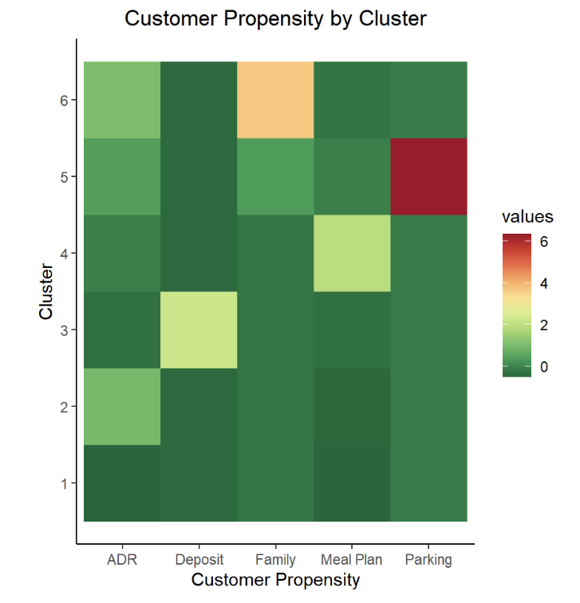

<link rel="stylesheet" href="styles.css" type="text/css">
<link rel="stylesheet" href="site_libs/academicons-1.9.1/css/academicons.min.css"/>

   

## **Hotel Customer Analytic**

 

🚨**THIS IS A FICTIONAL PROJECT MEANT AS AN EXAMPLE FOR THE STEPBYSTAT COMMUNITY.**

   

### 1. Figure

[Fig. K-Mean Clustering]

 

  

### 2. Goal
Segmenting all customers using K-mean clustering and then identifying recommendations for hotels by analyzing customer needs.

 

### 3. Methodology & Summary

  + These are two datasets with Portuguese hotel demand data and each observation represents a hotel booking. One of the hotels is a resort hotel(40,060 observations) and other is a city hotel(79,330 observations).
  + Established 6 marketing strategies to attract different customer groups for two hotels in Portugal by  segmenting 120,000 customers using k-means clustering with R programming 
  + As a result, we identified recommendations for hotels by analyzing customer needs, for example, parking and meal plans

 

### 4. Code

Please 

click [HERE](file:///C:/Users/junhy/Documents/Github/rayjkwon.github.io/resort-project.html) for the resort analysis report and code.

click [HERE](file:///C:/Users/junhy/Documents/Github/rayjkwon.github.io/city.html) for the city analysis report and code.

 

