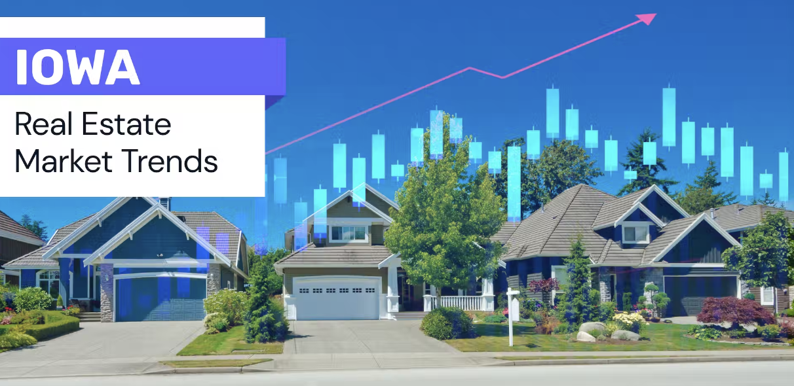

<link rel="stylesheet" href="styles.css" type="text/css">
<link rel="stylesheet" href="site_libs/academicons-1.9.1/css/academicons.min.css"/>

   

## **Predicting House Prices in Iowa**

 

   

### 1. Figure

[Fig. Iowa Housing Market]

 

  

### 2. Goal
To predict Iowa housing market using 81 variables 

 

### 3. Methodology & Summary

  + Developed an optimal multiple regression model which predicts an affordable price of houses with 105,000 datasets by analyzing variance inflation factor and partial F-test with python 
  
 

### 4. Code

Please click [HERE](files/final project_housing.html) for the analysis report and code.

 

