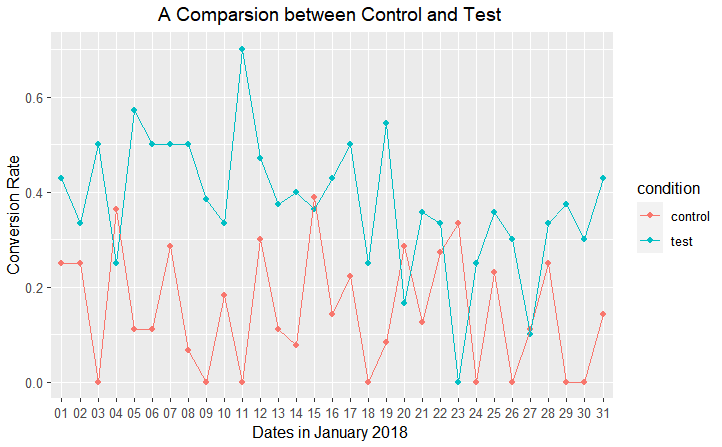

<link rel="stylesheet" href="styles.css" type="text/css">
<link rel="stylesheet" href="site_libs/academicons-1.9.1/css/academicons.min.css"/>

   

## **E-commerce AB test**

 

   

### 1. Figure

[Fig. Comparison of Advertising Photo Conversion Rate]

 

  

### 2. Goal
Determine the photograph that leads to a higher proportion of button clicks 

 

### 3. Methodology & Summary

  + Examined the better performance of click rate between two E-commerce advertising campaigns which are current and new photos by analyzing 13,000 datasets using A/B testing and logistic regression with R
  
 

### 4. Code

Please click [HERE](files/AB-test-project.html) for the analysis report and code.

 

