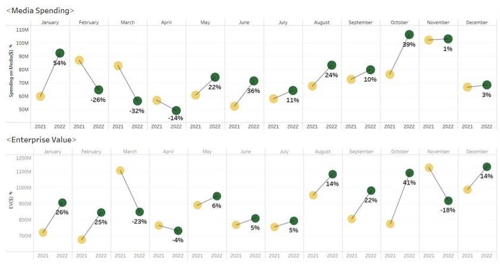

<link rel="stylesheet" href="styles.css" type="text/css">
<link rel="stylesheet" href="site_libs/academicons-1.9.1/css/academicons.min.css"/>

   

## **T-Mobile Media Analytics**

 

   

### 1. Figure

[Fig. Year on Year increase for Enterprise Value & Media Spending]

 

  

### 2. Goal
Make recommendations on how does the T-Mobile continue to grow, and what are some markets and advertising channels to invest in

 

### 3. Methodology & Summary

  +  Performed EDA, kNN clustering, RFM Analysis, Log-Log regression, customer analysis to dive deep into markets based on population, coverage, market share and then analyze channel and tactic effectiveness​
  
 

### 4. Code

Please click [HERE](https://uwnetid-my.sharepoint.com/:p:/g/personal/pkamal09_uw_edu/EdPwSs5dkVxAhfjWIgesfO4BOTpi-CZFb3HuMwGS1Xo4wQ?wdOrigin=TEAMS-ELECTRON.p2p.p2p&wdExp=TEAMS-CONTROL&wdhostclicktime=1686154843824&web=1) for the analysis report and code.

 

