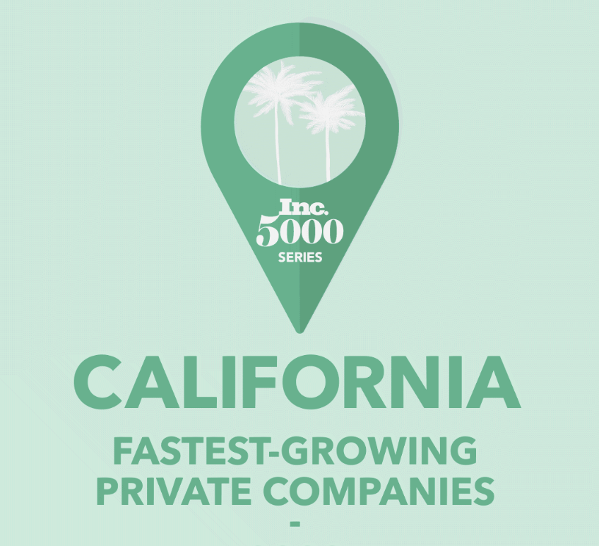

<link rel="stylesheet" href="styles.css" type="text/css">
<link rel="stylesheet" href="site_libs/academicons-1.9.1/css/academicons.min.css"/>

   

## **INC5000 Analysis**

 

   

### 1. Screenshot of Dashboard

   

### 2. Summary

+ California is the best state for the fastest-growing private companies.
+ Most companies and workers are located in California. 
+ The companies in California generate the highest revenue, compared to companies in other states.

   

### 3. Tableau Public

For more insights, please check my Tableau Public by clicking [HERE](https://public.tableau.com/views/incstory/Story1?:language=en-US&:display_count=n&:origin=viz_share_link).

